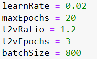

# Projet pour le brief_MedNet

Projet qui contient le code nécessaire au développement du brief MedNet

# Contexte

L’objectif étant de prouver les compétences techniques de notre start-up et de faire adhérer le corps médical au projet DATA Health HUB. Dans un souci d’accessibilité aux données, le POC se fera avec les données publiques du dataset MedNist.

Nous partons d’une application existante développée par les équipes du CHRU, un algorithme développé via Pytorch qui propose déjà de beaux résultats ,L'application sera développée en flask et permet de classifier sa radiographie.

Voici les missions attendues :

-Implémenter un modèle de classification ( Transfert Learning) avec Keras /TensorFlow

-Amélioration du modèle MedNet ( Pytorch) : Un modèle de DeepLearning a été élaboré. Il utilise un réseau de neurones afin de pouvoir classer les images médicales dans ces 6 catégories. Le modèle a obtenu un taux de 99% de prédictions correctes ce qui est un bon score.

-Création d'une interface et Evolution fonctionnelle : * L’application comprend 2 pages. L’application permet de sélectionner un fichier image et de le télécharger :Puis elle permet d’obtenir sa classification. Les informations affichées sont « ID » qui correspond au numéro allant de 1 à 6 de la classe et « Class » qui correspond au nom de la classe. L'application sera déployée via AzureWebapp. L'interface pourra se faire avec Flask et /ou Streamlit​

BONUS Il vous est demandé de pouvoir sélectionner un, plusieurs ou tous les fichiers d’un dossier, de le ou les télécharger et de prédire la classification.

# Mon Approche

Pour ce projet d'amelioration je suis partie sur une amelioration manuelle des parametres.
Vous vous demandez pourquoi je n'ai pas utilisé un gridSearch ou un randomsearch pour trouvé les paramétres optimaux, j'ai preferer tester les parametres un a un car je voulais comprendre comment marche le modele et a quoi servent ses parametres.
J'ai donc testez chaque parametres avec des valeurs differentes pour trouvez les plus optimaux.

# Modification des paramétres

Vous verrez a la suite les screens des paramétres utilisés ainsi que le résultat.
Le paramétre qui permet d'avoir de meilleur résultat est batchSize.

En descendant le batchSize a 8 dans modele cela nous fait un traitement du modele extremement long.

Ce dernier test ma permit d'avoir le meilleur résultat : 0.9984

# Interface 

